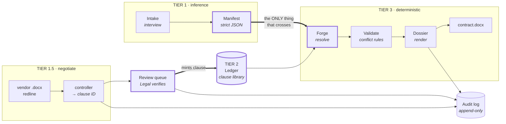
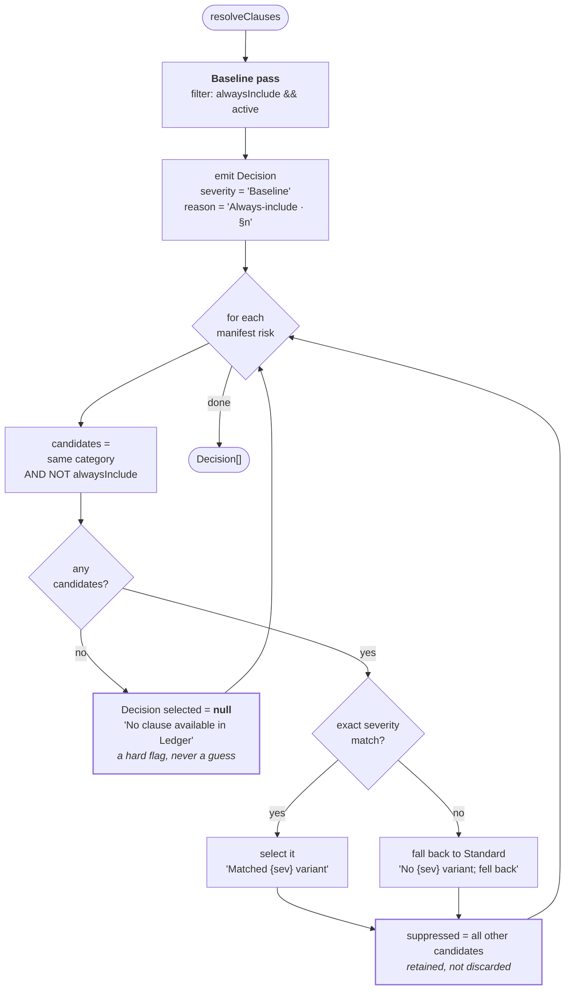
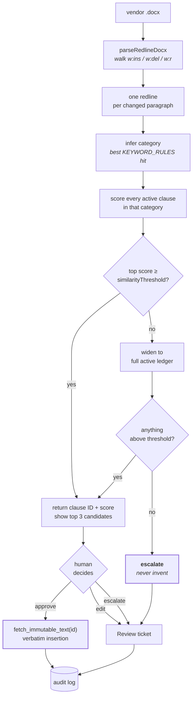
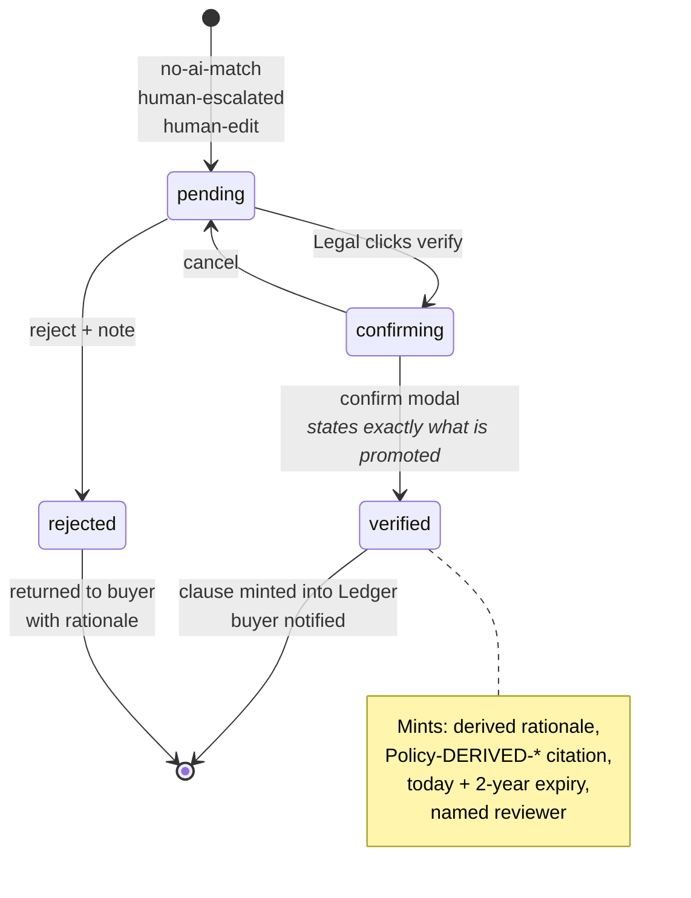
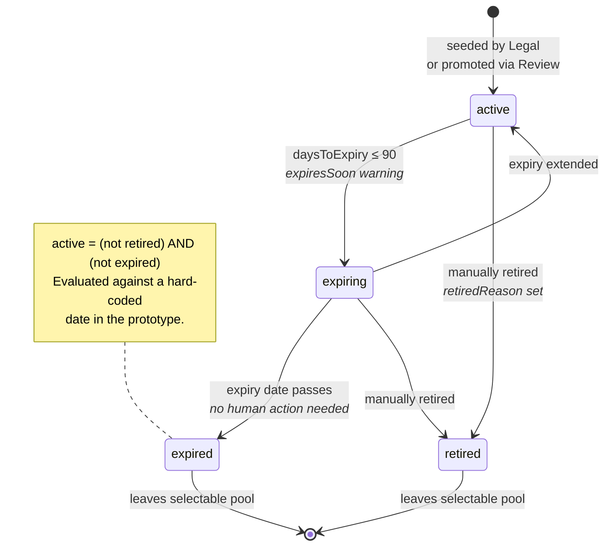
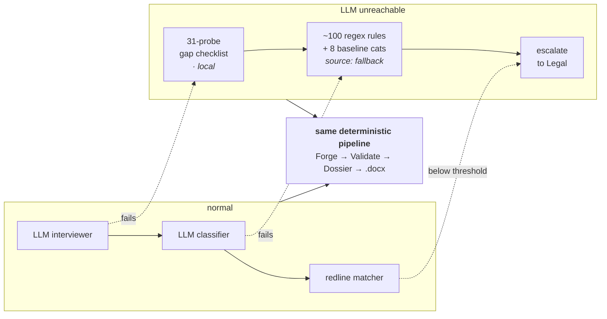

# Diagrams

The pipeline as pictures, plus the flows and state machines `ARCHITECTURE.md` describes in prose
but does not draw. Rendered by GitHub natively.

---

## 1. Pipeline and the trust boundary

The single most important line in the system is the one between Manifest and Forge.

Nothing downstream of the doubled arrow ever sees free text produced by a model. The manifest
carries only `{category, severity, justification}` triples — and `justification` is evidence shown
to reviewers, never contract text.

---

## 2. Resolution — `resolveClauses(manifest, ledger)`

A pure function. No network, no model. The baseline pass runs to completion before any
manifest risk is considered.

> The baseline pass filters on `active`; the manifest pass does not. See
> [finding #1](spec-vs-implementation.md#1-retired-and-expired-clauses-stay-in-the-manifest-driven-candidate-pool).

---

## 3. Redline adjudication

The controller's only permitted output is an **ID and a score**. Every path that cannot produce one
ends at a human.

Approve inserts already-approved text, so it creates **no** ticket — but it still writes an audit
event. Edit and escalate both create tickets.

---

## 4. Review ticket lifecycle

The only path by which new language enters the Ledger.

Deliberately slow and human-gated. There is no automated transition into `verified`.

---

## 5. Clause lifecycle

`active` is a computed property, not a stored one — which is why a clause can leave the pool with
nobody touching it.

Clause records are **never overwritten** — a contract executed under v1 must still resolve v1. See
[ADR-0006](decisions/ADR-0006-clause-expiry-is-computed-not-stored.md).

---

## 6. Degradation

Every inference call has a deterministic substitute, so the whole pipeline runs with the model
offline.

The output is a valid contract either way — assembled from the same approved clause text, because
the model was never the thing producing it. See
[ADR-0005](decisions/ADR-0005-deterministic-fallbacks.md).
